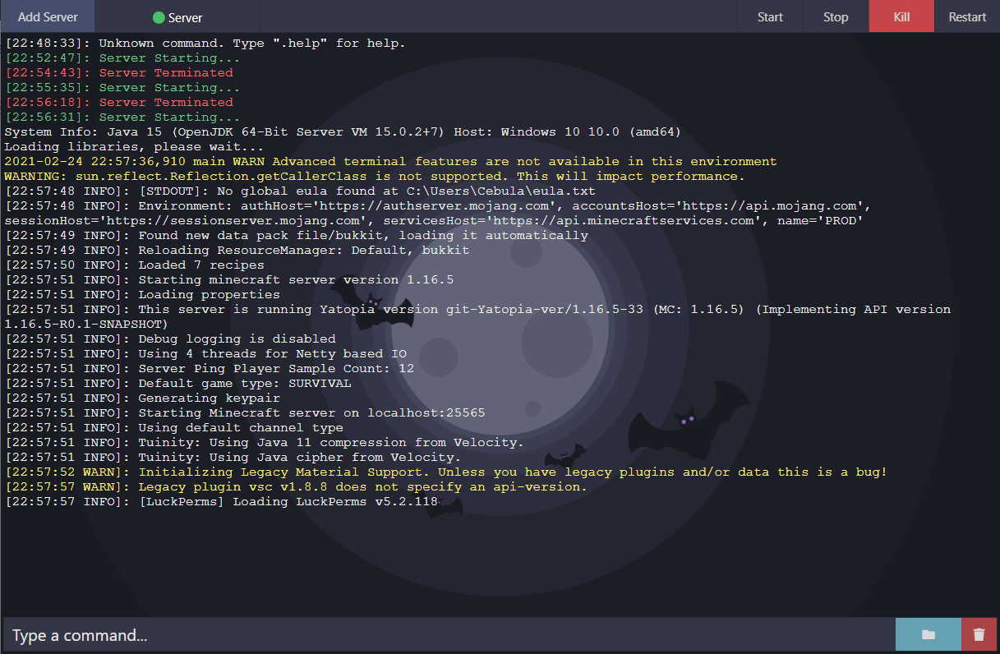

# Dracula for [Visual Spigot](https://www.spigotmc.org/resources/visual-spigot.87912/)

> A dark theme for [Visual Spigot](https://www.spigotmc.org/resources/visual-spigot.87912/).

## Install

All instructions can be found at [draculatheme.com/visualspigot](https://draculatheme.com/x).

## Team

This theme is maintained by the following person(s) and a bunch of [awesome contributors](https://github.com/dracula/template/graphs/contributors).
 |
--- |
[Kacper Smoliński](https://github.com/kacperleague9) |

## License

[MIT License](./LICENSE)
